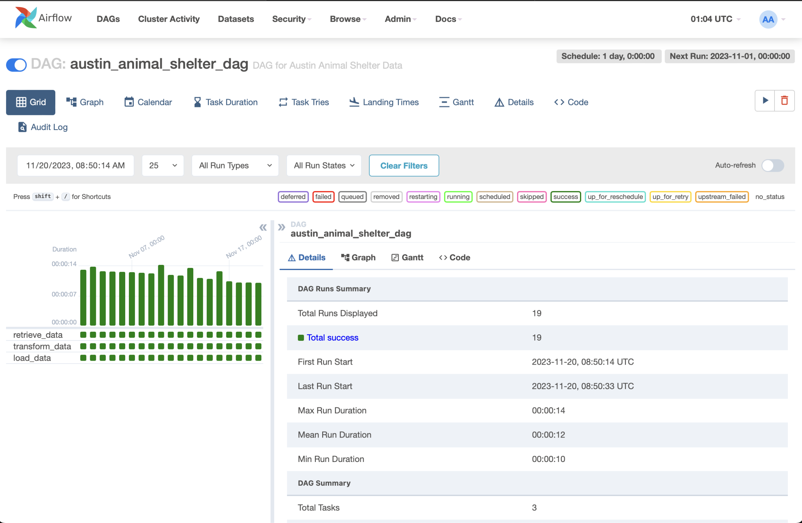
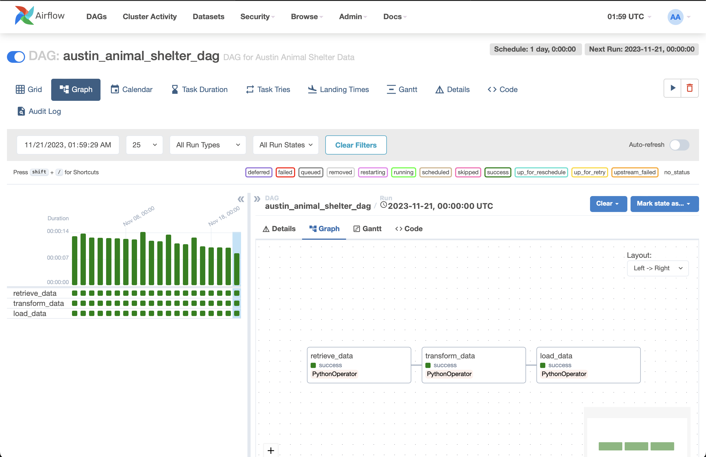
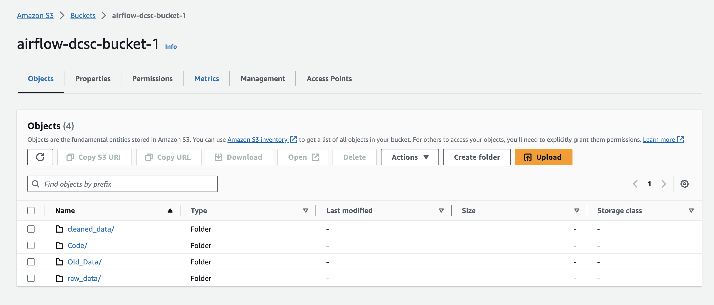
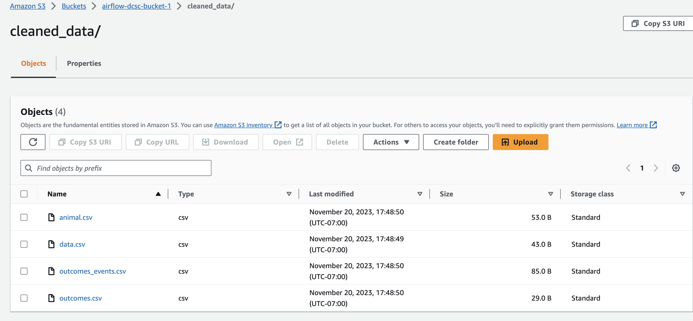
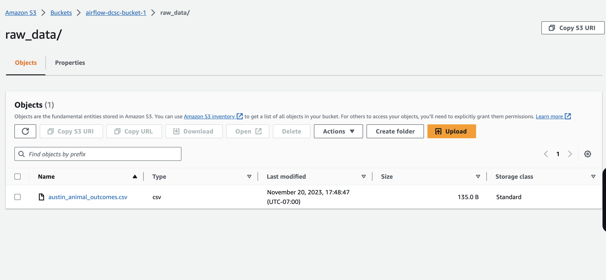
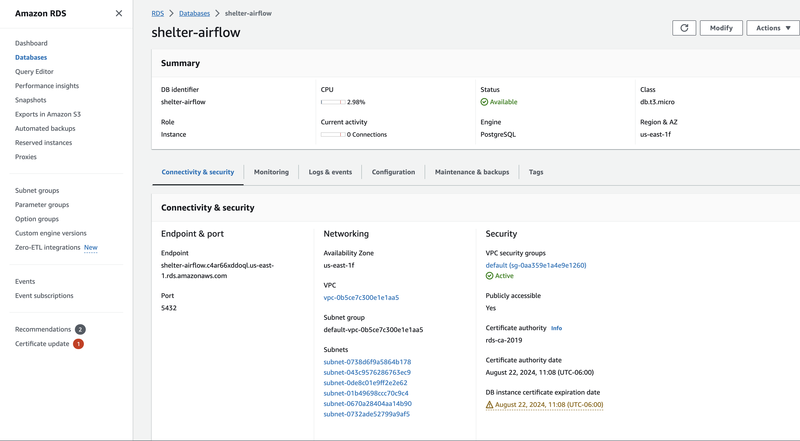
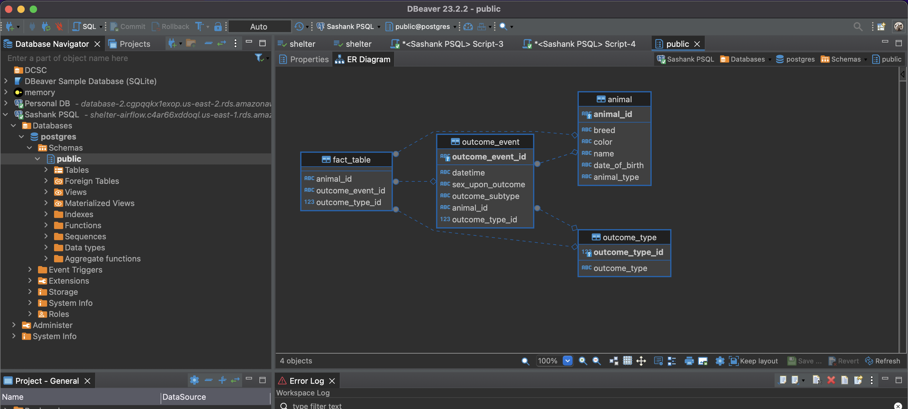
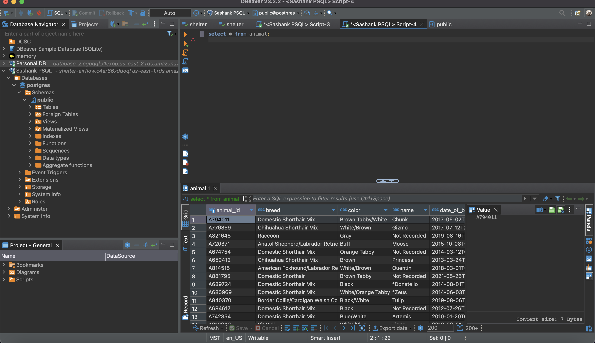

# Data Center Scale Computing

### CSCI-5253 - Fall 2023 - Dr. Alex Yarosh

---

### About the Repository

This repository is dedicated to hosting all current and future homework assignments for the course. Each assignment is organized into separate branches, represented as individual pull requests.

---

### Lab03: Airflow - Setup and Execution Guide

#### Setting Up Docker Compose

To initiate the Docker environment:

1. Ensure that the `docker-compose.yml` file is present in the directory (verify using the `ls` command).
2. Open your terminal or Windows Subsystem for Linux (WSL).
3. Execute the following command:

```bash
docker compose up
```

---

#### Demonstrations and Execution Evidence

##### Airflow DAG Visualization






##### Data Storage in S3 Bucket









##### Cloud Relational Database on Amazon RDS



##### Database Connectivity Test with DBeaver



##### Successful Data Loading via ETL Process

)

---

#### Important Note on Credentials

- Before executing the Lab 3 code, navigate to `/dags/secrets.env` and update the file with your own credentials. Additionally, run the `init.sql` file to establish the required table relationships in the database.

- For retaining the database PK and FK relationship it is suggested to run the `init.sql` on dbeaver 

---
